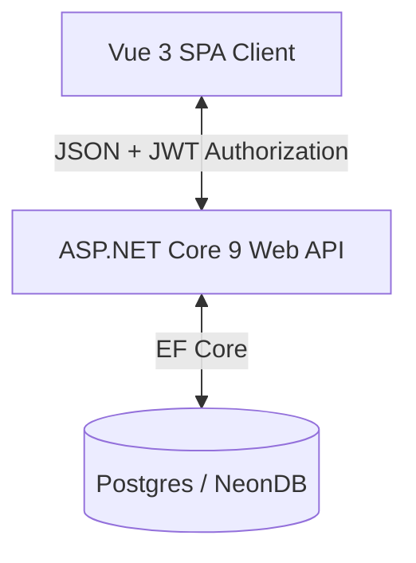

# إقامة | Iqamah — Salah Habit Establishment Platform

[](https://dotnet.microsoft.com/)
[](https://vuejs.org/)
[](https://vite.dev/)
[](https://tailwindcss.com/)
[](https://www.postgresql.org/)

**Iqamah (إقامة)** is a highly specialized, data-driven web application designed to help Muslims build, establish, and analyze their daily prayer (Salah/Namaz) habits. The system provides granular tracking for prayer punctuality, situational missed reasons, state machines for make-up (Qaza) tracking, and multi-year analytics.

---

## 📸 Interface Preview


*Figure 1: Fully responsive dark-mode dashboard showing daily Salah tracker.*


*Figure 2: Qaza make-up ledger displaying obligation status.*

---

## 🏗️ Architecture Overview

The project is structured as a modern, decoupled web application:



### 1. Server-Side (.NET 9)
Built following **Clean Architecture** patterns:
*   **Iqamah.Domain:** Contains core entities (`PrayerLog`, `QazaLog`, `User`), value objects, domain exceptions, and repository contracts.
*   **Iqamah.Application:** Implements the CQRS pattern using **MediatR** and contains handlers, commands, queries, and **FluentValidation** rules.
*   **Iqamah.Infrastructure:** Implements repository interfaces (`UserRepository`), database contexts using **EF Core**, and infrastructure services such as the `JwtProvider` (stateless JWT claims emission).
*   **Iqamah.API:** The entry point containing REST controllers, authentication middleware configurations, and a global problem-details exception handler.

### 2. Client-Side (Vue 3 + Vite)
Built as a highly reactive Single Page Application (SPA):
*   **Tailwind CSS v4:** Styling engine leveraging CSS variables and fluid, modern glassmorphic designs.
*   **Pinia Store:** Manages auth status (`stores/auth.ts`) and tracks prayer logs, pending debts, and charts data (`stores/prayer.ts`).
*   **Vue Router:** Controls page paths and enforces route guards to redirect unauthenticated requests.

---

## 💻 Frontend Client Implementation

### 📁 Codebase Structure
```
client/
├── src/
│   ├── __tests__/         # Unit tests (Vitest)
│   ├── assets/            # CSS styles and fonts
│   ├── components/        # Reusable UI component modules
│   ├── router/            # Route guards and URL definitions (vue-router)
│   ├── stores/            # State stores (Pinia)
│   │   ├── auth.ts        # Session persistence, login, registration, logout
│   │   └── prayer.ts      # Prayer logging, Qaza debt tracking, analytics, and normalizations
│   ├── types/             # TypeScript type definitions mirroring backend DTOs
│   ├── views/             # Major layout views (Dashboard, Qaza, Analytics, Login)
│   ├── App.vue            # Layout shell
│   └── main.ts            # Bootstrapper
```

### 🛠️ State Management & JSON Normalization
1. **The Enum Deserialization Challenge:** The backend `.NET 9` server is configured to serialize C# enums as string values in JSON payloads for API readability. For example, `PrayerName.Fajr` (value `0`) is serialized as `"Fajr"`. However, the client-side lookup arrays (`PRAYER_LABELS`, `WAQT_LABELS`, and `MISSED_REASON_LABELS`) are keyed using numeric values (`0`, `1`, etc.) to maintain type-safe enum patterns. Looking up properties using a string value (e.g., `PRAYER_LABELS["Fajr"]`) causes `TypeError: Cannot read properties of undefined` in JavaScript.
2. **The Solution (Store Normalization Layer):** To decouple the view templates from deserialization types, `stores/prayer.ts` implements a mapping/normalization layer. Every response fetched from backend endpoints is automatically passed through normalizers:
   * `normalizePrayerLog()`: Normalizes enums `prayerName`, `waqtStatus`, and `missedReason` into integers.
   * `normalizeQazaLog()`: Maps pending make-up logs.
   * `normalizeAnalytics()`: Normalizes the keys of `prayerStats` from strings to integers, enabling clean numeric lookups in charts and tables.

---

## 🔒 Security & Identity System

The application implements a stateless **JWT Bearer Authentication** model:
1.  **Registration / Login:** Hashes user passwords using **BCrypt.Net** and issues a token signed with an HMAC-SHA256 signature containing claims (`sub`, `name`, `email`).
2.  **Explicit Claims Resolution:** The API controllers are secured with `[Authorize]` attributes. User identities are resolved implicitly via claims parameters (`HttpContext.User.FindFirstValue(ClaimTypes.NameIdentifier)`), eliminating insecure client-provided parameter spoofing.
3.  **Client Persistence:** The JWT is safely stored in `localStorage` and attached to outgoing requests via interceptors.
4.  **Client-Side Route Protection:** Protected routes (Dashboard, Qaza, Analytics) are guarded by checking token expiration and authentication state, redirecting unauthorized traffic to the `/login` route.

---

## 🚀 Getting Started

### Prerequisites
*   [.NET 9 SDK](https://dotnet.microsoft.com/en-us/download/dotnet/9.0)
*   [Node.js (v20+ or v22+)](https://nodejs.org/)

### Backend Setup (.NET)
1. Navigate to the server folder:
   ```bash
   cd server
   ```
2. Restore dependencies:
   ```bash
   dotnet restore
   ```
3. Update connection string in `Iqamah.API/appsettings.Development.json` pointing to your PostgreSQL instance.
4. Run migrations:
   ```bash
   dotnet ef database update --project Iqamah.Infrastructure/Iqamah.Infrastructure.csproj --startup-project Iqamah.API/Iqamah.API.csproj
   ```
5. Launch the Web API:
   ```bash
   dotnet run --project Iqamah.API/Iqamah.API.csproj --launch-profile http
   ```
   *The server will start listening at `http://localhost:5229`.*

### Frontend Setup (Vue)
1. Navigate to the client folder:
   ```bash
   cd client
   ```
2. Install npm dependencies:
   ```bash
   npm install
   ```
3. Launch development server:
   ```bash
   npm run dev
   ```
   *The client will start listening at `http://localhost:5173`.*

---

## 🧪 Verification & Testing

### Running Server Tests
Run backend C# unit tests using:
```bash
cd server
dotnet test
```

### Running Client Tests & Linters
Run Vite verification commands using:
```bash
cd client
npm run test:unit -- --run  # Run Vitest test suite
npm run lint                # Run ESLint & Oxlint code style checks
npm run format              # Run Prettier code formatting
```